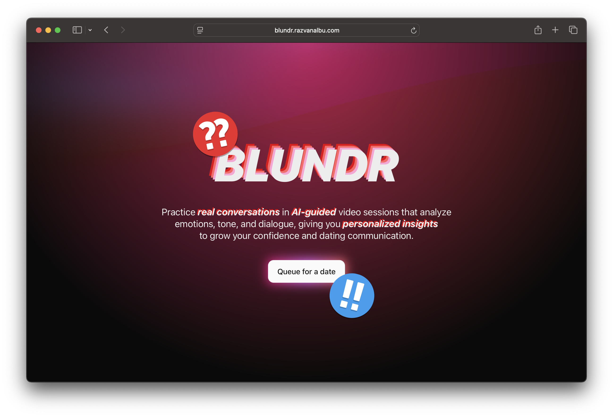

# Blundr

 

**Blundr** is an AI-driven dating-coach system designed to help users improve their communication and interpersonal skills through simulated dating interactions. Users are matched randomly and engage in live video calls that the system performs emotion, speech, and transcription analysis on. After each session, a Large Language Model evaluates key conversational moments, rated with a [chess.com](https://www.chess.com) style scale and provides targeted feedback.

> Detailed project documentation, including Requirements and Architecture Design, can be found on our [Project Wiki](https://git.chalmers.se/orlovs/blundr/-/wikis).

### Live Access

The project is deployed and accessible at: **[blundr.razvanalbu.com](https://blundr.razvanalbu.com)**

### System Architecture

Blundr is built as a distributed microservices ecosystem to handle concurrent, real-time data streams. The main workflows are:

- _Data Acquisition_: NextJS Proxy and Chatroom Service manage live WebRTC streams and WebSocket signaling between clients.
- _Inference_: Parallel services (FER and VER) process video and audio frames to detect emotional states.
- _Transcription_: Audio is processed via Whisper Large v3 to generate timestamped text.
- _Aggregation & Evaluation_: The Aggregator Service syncs transcripts with emotional data, which is then evaluated by an LLM (via Ollama).

_Detailed component diagram is available in the [Architecture section of the Wiki](https://git.chalmers.se/orlovs/blundr/-/wikis/architecture)._

### Project Structure & Components

Each component of the system is located in the `src` directory. Click the links below to view specific documentation regarding setup, compilation, and execution:

- [Admin API](./src/admin-api/README.md): Backend service for administrative and model controls.
- [Admin CLI](./src/cli/README.md): Administrative Command Line Interface for system management.
- [FER Service](./src/face-emotion-service/README.md): ML service specialized in facial expression recognition.
- [VER Service](./src/voice-emotion-service/README.md): ML service for voice-based emotion detection.
- [Ollama](./src/local-ollama/README.md): Local LLM orchestration for session summarization.
- [Aggregator](./src/aggregator-service/README.md): Consolidates emotional data and transcripts for LLM analysis.
- [Chatroom](./src/chatroom/README.md): Manages live WebRTC/WebSocket connections for the video dating sessions.
- [Frontend](./src/frontend/README.md): The NextJS web application for users.

### Project Members

- Aliaksei Khval (guskhval@student.gu.se)
- Danis Music (gusmusida@student.gu.se)
- Maxine Orlen (gusorloma@student.gu.se)
- Razvan Albu (gusalbura@student.gu.se)
